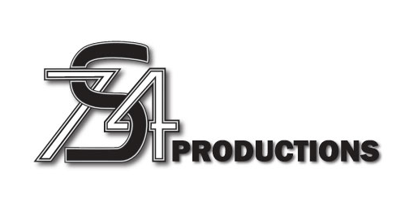

<p align="center">
  
</p>

# S74 Productions – Performing Arts & Entertainment (Static Site)

This is a single-page marketing website I designed and built for **S74 Productions**, a performing arts company that
provides creative direction and choreography for stage and screen.

I created this project while studying for my **Front-End Web Development Techdegree at Treehouse**, applying my growing
HTML and CSS skills to a real-world client brief. As a student developer, I handled every stage — from visual design and
media editing to layout implementation — delivering a fully responsive static site.

> The site features a custom background, logo, and promotional video that I edited myself, showcasing both
> design and front-end creativity.

## 🌐 Live Demo

**Live:** [S74 Productions](https://samatkinsonmodeste.github.io/s74-productions/)

## 🔍 Features

- One-page promotional website with smooth scrolling sections
- Embedded video showreel featuring original choreography
- Custom logo and background graphics designed in **Adobe Illustrator** and **Photoshop**
- Responsive layout built entirely with **HTML and CSS**
- Lightweight, fast-loading static build — no frameworks required

## 🛠 Tech Stack

- **HTML5**
- **CSS3**
- **Normalize.css**
- **Adobe Illustrator** (logo design)
- **Adobe Photoshop** (image editing)
- **Adobe Premiere Pro** (video editing)

## 🗂 Project Structure

```text
.
├── index.html
├── css/
│   ├── normalize.css
│   └── s74Pro.css
├── img/
├── video/
│   ├── s74-workShowreel.mp4
│   └── s74-workShowreel.ogg
└── favicon/
```

## 📦 Notes / Archive

- Built while completing my **Treehouse Front-End Techdegree**.
- Developed entirely with HTML and CSS — no JavaScript required.
- Demonstrates problem-solving, creativity, and a professional client delivery.

## 📄 License

Not licensed for commercial reuse - client work for **S74 Productions**.
